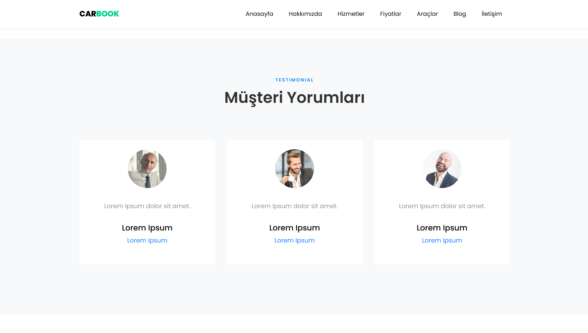

# CarBook

# Proje Detayı
Bu proje Asp.Net ile geliştirilmiş bir araç kiralama sitesidir.

## Kullanılan Teknolojiler
- ASP.NET
- Web API
- Onion Architecture
- CQRS
- Mediator
- SQL
- Entity Framework

## Ekran Görüntüleri

